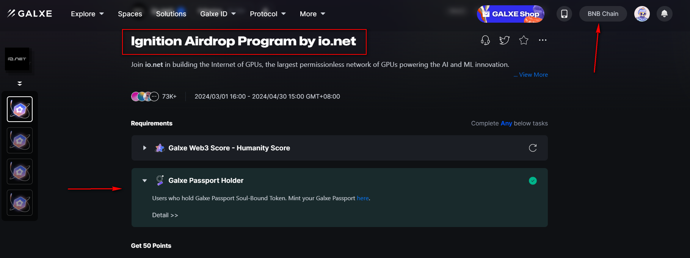
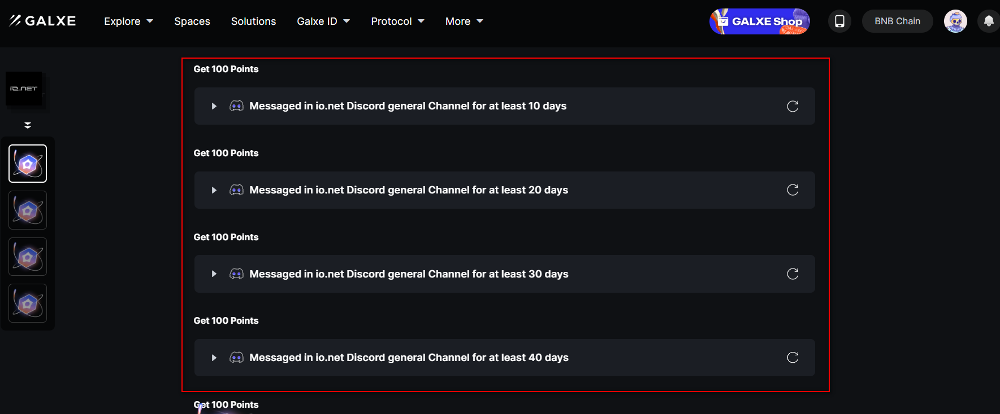
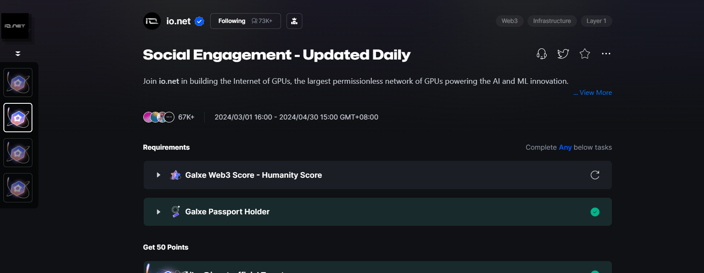
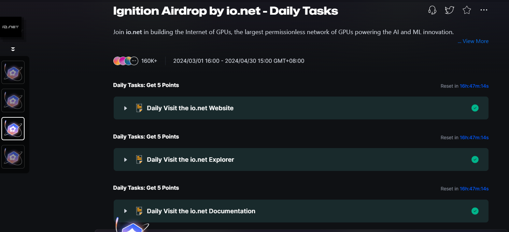
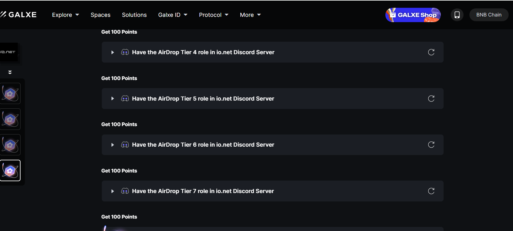

# io.net_tutorial
io.net新手参与获取空投教程
> 这可能是全网你能看到的最全的中文教程🤟

## 申明
此项目无任何不良引导，所有信息均来自于互联网，如有错误请提PR

## io.net是什么？
io.net组建了一个中心化计算网络，跟render network有很强的联系(RNDR).
Multicoin Capital和Moonhill Capital参投，3月1日启动的积分奖励计划，预计4月底推出IO代币

- [官网](https://io.net/)
- [官方推特](https://twitter.com/ionet_official)
- [官方discord](https://discord.com/invite/X8wgHmURKK) (这是官方的邀请链接，失效将及时更新)

## 如何参与并领取空投
io的参与分为两部分，银河任务和官方项目的参与

### 银河任务
银河任务分成四个部分（不用慌张，其实很简单）
- [👉银河任务一 Ignition Airdrop Program by io.net](#银河任务一)
- [👉银河任务二 Social Engagement Updated Daily](#银河任务二)
- [👉银河任务三 Ignition Airdrop by io.net Daily Tasks](#银河任务三)
- [👉银河任务四 Discord Tiers](#银河任务四)

### 准备条件
- BNB chain钱包
- twitter账号
- discord账号

#### <a id="银河任务一">银河任务一 Ignition Airdrop Program</a>

打开后我建议新手直接无视Galxe Web3 Score - Humanity Score，打开Galxe Passport Holder
链接自己的BNB钱包。注意这里有需要身份验证，钱包里面准备**0.02**个BNB（大约8U）

大多数任务都非常简答，所以大家就动动小手就好了。

注意这里有一些需要在discord中活跃的任务，这个笔者帮不了大家，只能靠大家自己活跃了。

### 👉[点击链接开始任务一](https://galxe.com/8xehTTQLX6wAAFMgKa7UiH/campaign/GCQiot4SR2?referral_code=GRFr2JSkbCmvW3p_ptQGK-R3ftE4TeDlIQ8GYUQ8Xr1TwqM)👈

#### <a id="银河任务二">银河任务二 Social Engagement Updated Daily</a>
任务也非常简单，按照网页上来就好了

### 👉[点击链接开始任务二](https://galxe.com/8xehTTQLX6wAAFMgKa7UiH/campaign/GCNzot4eCx?referral_code=GRFr2JNgrCmvVv4tJtQGK-R3aOV6bpF17rxnwgQD3JxZATW)👈

#### <a id="银河任务三">银河任务三 Ignition Airdrop Daily Tasks</a>
任务三是每次浏览任务，每天没事的时候点进来浏览下网页就好了。（注意是浏览io.net的网页，不是任务页面哈）

### 👉[点击链接开始任务三](https://galxe.com/8xehTTQLX6wAAFMgKa7UiH/campaign/GCNLot4e58)👈

#### <a id="银河任务四">银河任务四 Discord Tiers</a>
任务四需要在discord中活跃，笔者告诉大家个办法，每天在dc里面帮助他人十分钟，很容易能到tier3

### 👉[点击链接开始任务四](https://galxe.com/8xehTTQLX6wAAFMgKa7UiH/campaign/GCkwmt4x9i?referral_code=GRFr2Joj7KmvUaCpZtQGK-R3UdLfy4sY71R5MFar4UdkBFQ)👈

